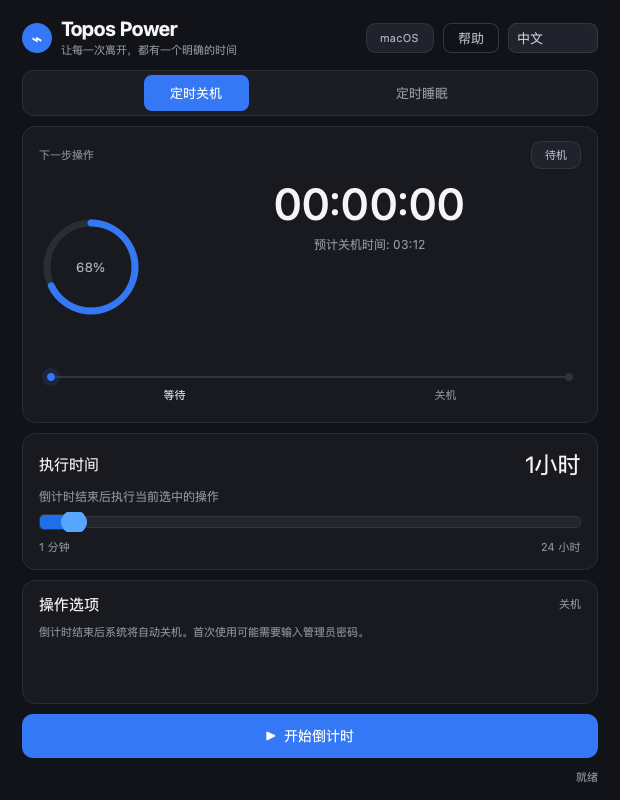
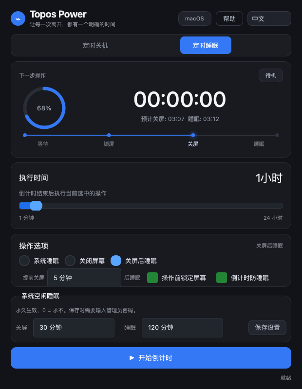

# Topos Power

[中文](README.md) | **English**

Topos Power is a cross-platform power timer built with PyQt6. It supports:

- Scheduled shutdown
- Scheduled sleep
- Display-only sleep
- Turning off the display before sleep
- Reading and editing macOS idle display/sleep settings
- Preventing automatic system sleep during a countdown
- Animated circular progress, power phase timeline, and subtle breathing effects
- Instant Chinese and English interface switching

## Screenshots

<p align="center">
  
  
</p>

## Project structure

```text
Topos Power/
├── src/topos_power/
│   ├── app.py                 # Application entry point
│   ├── config.py              # Application name and version
│   ├── core/localization.py   # Chinese and English interface text
│   ├── core/power_manager.py  # Cross-platform power operations
│   └── ui/                    # Qt interface, widgets, and styles
├── tests/                     # Automated tests
├── pyproject.toml
└── requirements.txt
```

## How to run

### Method 1: One-click launch scripts

On macOS, double-click `run_topos.command` in the project root. If macOS blocks the script, run it from Terminal:

```bash
./run_topos.command
```

On Windows, double-click `run_topos.bat` in the project root.

Both scripts prefer the project's `.venv` and support the `src` layout automatically.

### Method 2: Traditional Python launch

```bash
cd "Topos Power"
python3 -m venv .venv
source .venv/bin/activate
pip install -e .
python -m topos_power
```

You can also install the command-line entry point:

```bash
topos-power
```

## Interface languages

Use the language selector in the top-right corner to switch between Chinese and English. The choice is applied immediately and saved locally for the next launch.

## License and copyright

Copyright (C) 2026 ToposHub

Topos Power is free software: you can redistribute it and/or modify it under the terms of the GNU General Public License as published by the Free Software Foundation, either version 3 of the License, or (at your option) any later version.

This project is licensed under the GNU General Public License v3.0 or later (GPL-3.0-or-later). See [LICENSE](LICENSE) for the complete license text. The software is provided “as is”, without warranty of any kind.

When distributing modified or packaged versions, retain the copyright notice, license text, and third-party notices, and provide the corresponding source code as required by GPL-3.0-or-later.

Topos Power depends on PyQt6. The PyQt6 community version is licensed under GPLv3. Distributions that include PyQt6, Qt, or other third-party components must comply with the licenses that apply to those exact components. See [THIRD_PARTY_NOTICES.md](THIRD_PARTY_NOTICES.md).

Please read [CONTRIBUTING.md](CONTRIBUTING.md) before submitting contributions.

## Run tests

```bash
pytest
```

## macOS permissions

Sleep, display control, and `pmset` changes are performed through macOS system commands. The first use may require an administrator password. Lock-screen operations may also require allowing the application to control “System Events” under System Settings → Privacy & Security → Automation/Accessibility.

## Design principles

Power operations are separated from the Qt interface. System command results are returned to the interface so failed operations are not shown as successful. On macOS, display sleep uses `pmset displaysleepnow` and does not modify display gamma settings.
