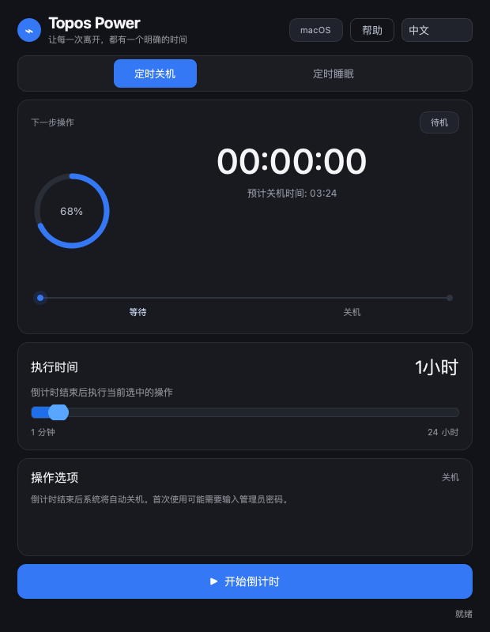
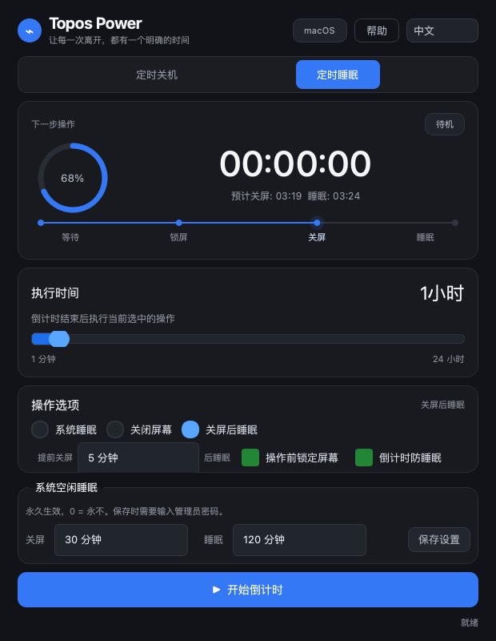

# Topos Power

**中文** | [English](README.md)

Topos Power 是一个基于 PyQt6 的跨平台电源定时工具，支持：

- 定时关机
- 定时睡眠
- 仅关闭显示器
- 先关闭显示器再进入睡眠
- macOS/Windows 系统空闲关屏/睡眠参数读取与修改
- 倒计时期间阻止系统自动睡眠
- 环形倒计时进度、阶段时间线与轻量呼吸动画
- 中英文界面即时切换

## 界面预览

<p align="center">
  
  
</p>

## 项目结构

```text
Topos Power/
├── src/topos_power/
│   ├── app.py                 # 应用入口
│   ├── config.py              # 应用名称与版本
│   ├── core/localization.py   # 中文/英文界面文案
│   ├── core/power_manager.py  # 跨平台系统电源能力
│   └── ui/                    # Qt 界面与样式
├── tests/                     # 自动化测试
├── pyproject.toml
└── requirements.txt
```

## 使用教程

### 定时关机

1. 选择 **定时关机**。
2. 拖动“执行时间”滑块，设置倒计时长度。
3. 查看预计关机时间，点击 **开始倒计时**。
4. 倒计时结束前点击 **停止运行**，即可取消关机计划。

### 定时睡眠

1. 选择 **定时睡眠**。
2. 选择一种操作模式：
   - **系统睡眠**：倒计时结束后让电脑进入睡眠。
   - **关闭屏幕**：关闭显示器，但保持电脑继续运行。
   - **关屏后睡眠**：可选择提前锁屏、关闭显示器，并在倒计时结束时进入睡眠。
3. 如果希望倒计时不被系统空闲睡眠打断，可以启用 **倒计时防睡眠**。
4. 在 macOS 和 Windows 上，进入定时睡眠模式后可以查看系统空闲关屏/睡眠设置。

### 系统空闲设置

这些设置控制电脑在一段时间没有键盘或鼠标操作后如何处理，与 Topos Power 的一次性倒计时不同：

- **关屏**：控制显示器多久后关闭。
- **睡眠**：控制电脑多久后进入系统睡眠。
- `0` 表示 **永不**。
- Windows 显示的是当前电源计划的“接通电源”值，保存时会同步修改接通电源和电池供电两种状态。

## 多系统支持

| 功能 | macOS | Windows | Linux | 说明 |
| --- | :---: | :---: | :---: | --- |
| 定时关机 | ✓ | ✓ | ✓ | 使用系统原生关机计划 |
| 定时系统睡眠 | ✓ | ✓ | ✓ | 使用操作系统睡眠命令 |
| 关闭显示器 | ✓ | ✓ | ✓ | 电脑继续保持运行 |
| 操作前锁定屏幕 | ✓ | ✓ | ✓ | 使用系统原生锁屏机制 |
| 倒计时防止自动睡眠 | ✓ | — | — | 目前通过 macOS `caffeinate` 实现 |
| 读取空闲关屏时间 | ✓ | ✓ | — | Linux 桌面环境接口不统一 |
| 读取空闲睡眠时间 | ✓ | ✓ | — | Linux 桌面环境接口不统一 |
| 修改空闲关屏时间 | ✓ | ✓ | — | Windows 会同时修改 AC 和电池配置 |
| 修改空闲睡眠时间 | ✓ | ✓ | — | `0` 表示永不 |
| 中文 / English 界面 | ✓ | ✓ | ✓ | 下次启动继续使用上次选择 |
| 系统托盘运行 | ✓ | ✓ | ✓ | 取决于桌面环境是否提供托盘支持 |

### 系统原生适配层

| 平台 | 关机 | 睡眠 | 关屏 | 锁屏 | 空闲设置 |
| --- | --- | --- | --- | --- | --- |
| macOS | AppleScript 调用 `shutdown` | System Events | `pmset displaysleepnow` | System Events | `pmset -g` / `pmset -a` |
| Windows | `shutdown.exe` | `SetSuspendState` | `SC_MONITORPOWER` | `LockWorkStation` | `powercfg /query` / `powercfg /change` |
| Linux | `shutdown` | `systemctl suspend` | `xset` / `xdg-screensaver` | `loginctl` / 桌面工具 | 依赖桌面环境，暂未统一启用 |

### 倒计时模式

| 模式 | 倒计时结束时 | 可选步骤 | 适用场景 |
| --- | --- | --- | --- |
| 定时关机 | 关闭电脑 | 锁定屏幕 | 完成长时间任务后关机 |
| 系统睡眠 | 进入系统睡眠 | 锁定屏幕 | 暂停工作并节省电量 |
| 仅关闭屏幕 | 关闭显示器 | 锁定屏幕 | 保持下载或服务继续运行 |
| 关屏后睡眠 | 提前关屏，结束时进入睡眠 | 锁屏、提前关屏时间 | 降低屏幕功耗并保持明确的睡眠时间 |

Linux 不同桌面环境对空闲电源设置使用不同接口。核心电源操作仍然可用；在 GNOME、KDE、Xfce 等环境形成可靠的统一方案前，应用会隐藏系统空闲设置面板，避免误修改。

## 设计说明

Topos Power 将界面、本地化和操作系统命令分离：

```text
Qt 界面
    ├── 倒计时状态与动画控件
    ├── 中文 / English 本地化
    └── 用户操作
             │
             ▼
PowerManager 系统适配层
    ├── macOS：pmset / AppleScript / caffeinate
    ├── Windows：shutdown / powercfg / Windows API
    └── Linux：systemctl / xset / 桌面会话命令
```

倒计时由 Qt 事件循环驱动，可能阻塞界面的系统操作放在后台线程中执行。环形进度和阶段时间线负责提供状态反馈，不改变底层电源命令的行为。

## 运行方式

### 方法一：一键启动

macOS：双击项目根目录中的 `run_topos.command` 即可启动。如果系统阻止执行，也可以在终端运行：

```bash
./run_topos.command
```

Windows：双击项目根目录中的 `run_topos.bat` 即可启动。

两个启动脚本都会优先使用项目中的 `.venv`，并自动处理 `src` 布局。

### 方法二：传统 Python 启动

```bash
cd "Topos Power"
python3 -m venv .venv
source .venv/bin/activate
pip install -e .
python -m topos_power
```

也可以安装命令行入口：

```bash
topos-power
```

## 界面语言

应用顶部右侧提供中文和 English 两种语言选择。选择会立即刷新界面，并保存在本机，下次启动时自动使用上次的语言。

## 许可证与版权

Copyright (C) 2026 ToposHub

Topos Power is free software: you can redistribute it and/or modify it under the terms of the GNU General Public License as published by the Free Software Foundation, either version 3 of the License, or (at your option) any later version.

本项目采用 GNU General Public License v3.0 or later（GPL-3.0-or-later）授权，完整协议见 [LICENSE](LICENSE)。项目按“现状”提供，不对适用性、稳定性或因使用本软件造成的任何损失作保证。

发布本项目的修改版或打包版时，请保留版权声明、许可证文本和第三方许可说明，并按照 GPL-3.0-or-later 提供对应源代码。

当前项目依赖 PyQt6。PyQt6 社区版本采用 GPLv3 授权；分发包含 PyQt6 的应用时，还必须遵守 PyQt6、Qt 及其他实际打包组件各自的许可证要求，详见 [THIRD_PARTY_NOTICES.md](THIRD_PARTY_NOTICES.md)。

贡献代码前请阅读 [CONTRIBUTING.md](CONTRIBUTING.md)。

运行测试：

```bash
pytest
```

开发时建议使用 `pip install -e .` 以可编辑模式安装项目；修改电源管理、本地化或界面代码后，运行完整测试套件进行验证。

## 多系统说明

- macOS 使用 `pmset` 和 AppleScript 完成电源操作及空闲设置，首次使用时可能需要输入管理员密码。
- Windows 使用系统自带的 `powercfg` 修改当前电源计划，空闲设置面板会同步修改接通电源和电池供电两种状态。
- Linux 已支持核心电源操作，但由于 GNOME、KDE、Xfce 等桌面环境使用不同的配置接口，目前还没有统一实现空闲关屏/睡眠设置。
- 锁屏操作可能需要额外的操作系统权限。

## 设计原则

电源操作与 Qt 界面分离，系统命令返回值会传回界面，避免命令失败时显示“已成功”。macOS 关屏使用 `pmset displaysleepnow`，不修改显示器伽马值。
